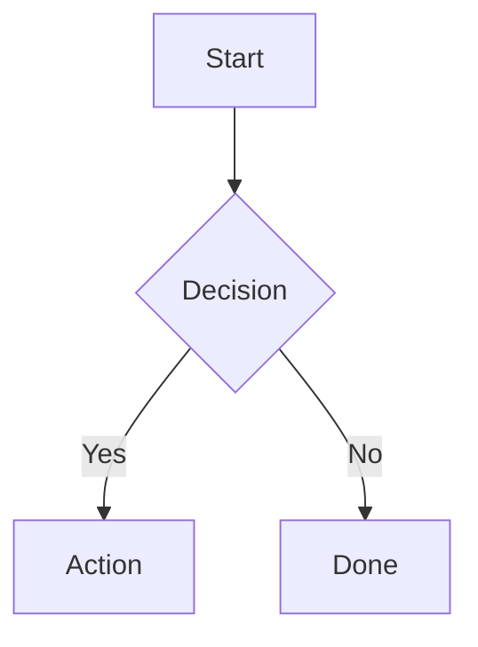
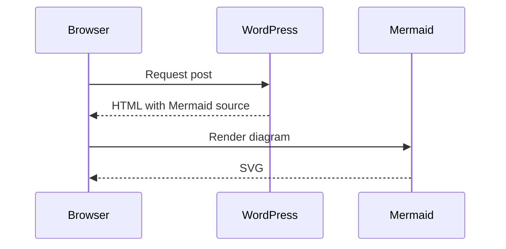
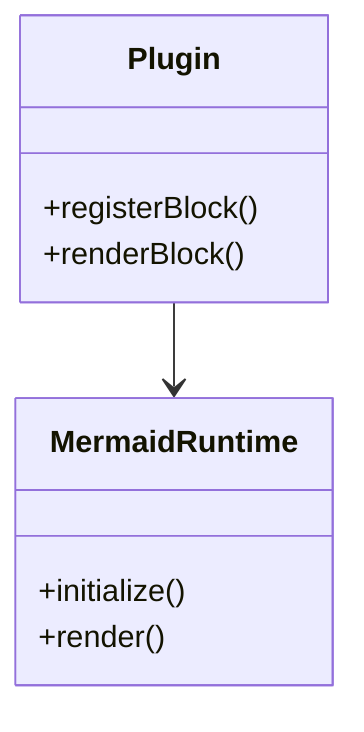

# Mermaid Content Blocks

[](LICENSE)
[](https://wordpress.org)
[](https://www.php.net)
[](https://github.com/Monotoba/mermaid-content-blocks/releases)

A WordPress plugin that adds a dynamic Gutenberg block for rendering Mermaid diagrams in posts and pages.

## Features

- **Mermaid Diagram Block** – Create and edit Mermaid diagrams directly in the WordPress block editor
- **Frontend Rendering** – Diagrams render only when the block appears on the page, using Mermaid 11.15.0
- **Live Editor Preview** – See diagram changes in real-time while editing
- **Multiple Themes** – Built-in themes: default, neutral, dark, forest, and base
- **Optional Captions** – Add descriptive text below diagrams
- **Source Display** – Optionally show the Mermaid source code below the rendered diagram
- **Strict Security** – Uses Mermaid's strict security configuration to prevent XSS attacks
- **Graceful Fallback** – Mermaid source remains visible if JavaScript is disabled

## Installation

### Via WordPress Plugin Directory (When Available)
1. Go to **Plugins > Add New** in your WordPress admin
2. Search for "Mermaid Content Blocks"
3. Click **Install Now** and then **Activate**

### Manual Installation
1. Download the plugin from the [releases page](https://github.com/Monotoba/mermaid-content-blocks/releases)
2. Upload the `mermaid-content-blocks` folder to `/wp-content/plugins/`
3. Go to **Plugins** in WordPress admin and activate "Mermaid Content Blocks"
4. You're ready to use the block!

## Quick Start

1. Edit or create a post/page in WordPress
2. Click the **+** button to add a block
3. Search for "Mermaid Diagram" and insert the block
4. Enter or paste your Mermaid diagram syntax
5. (Optional) Add a caption and configure theme
6. Publish!

## Examples

### Flowchart



### Sequence Diagram



### Class Diagram



See [examples.md](examples.md) for more diagram types.

## Content Security Policy

The plugin loads Mermaid from jsDelivr CDN by default:

```
https://cdn.jsdelivr.net/npm/mermaid@11.15.0/dist/mermaid.min.js
```

### CSP Configuration

If your WordPress site has a restrictive Content Security Policy (CSP), you need to allow this script source:

```
script-src 'self' https://cdn.jsdelivr.net
```

**Alternatively**, you can bundle Mermaid locally and modify the plugin to use it. Edit the `mcb_register_block()` function in `mermaid-content-blocks.php` and update the `mcb-mermaid-lib` script registration.

## Security

### Security Posture

The plugin implements multiple layers of security:

- **Strict Mermaid Security Level** – Prevents diagram-level code execution
- **HTML Labels Disabled** – Prevents HTML injection in diagram labels
- **Pinned Mermaid Version** – Uses version 11.15.0, not a floating "latest" tag
- **Output Escaping** – All user input is properly escaped before rendering
- **No Admin Privileges Required** – Plugin functionality doesn't elevate user capabilities

### Important Notes

- Authors who can edit posts can publish Mermaid diagrams
- Do not grant post editing privileges to untrusted users
- Mermaid diagrams are stored as-is in the post content
- Always keep WordPress and Mermaid updated

## Testing

### Running Tests Locally

From the plugin directory, run:

```bash
bash tools/smoke-test.sh
```

This script:
- Validates PHP syntax using `php -l`
- Validates JavaScript syntax using `node --check`
- Requires `php` and `node` to be installed

### Manual Testing

See [tests/manual-test-plan.md](tests/manual-test-plan.md) for comprehensive testing procedures including:
- Plugin activation
- Editor block functionality
- Frontend rendering
- Error handling
- Security checks

## Requirements

- **WordPress:** 7.0 or later
- **PHP:** 7.4 or later
- **Browser:** Modern browser with ES6+ support

## Versioning

This project follows [Semantic Versioning](https://semver.org/):
- **MAJOR** – Breaking changes or significant new features
- **MINOR** – Backward-compatible new features
- **PATCH** – Bug fixes and security patches

## License

This project is licensed under the [MIT License](LICENSE) – see the LICENSE file for details.

## Support

For issues, feature requests, or questions:
- Open an [issue on GitHub](https://github.com/Monotoba/mermaid-content-blocks/issues)
- Check [existing discussions](https://github.com/Monotoba/mermaid-content-blocks/discussions)

## Credits

- Plugin author: Monotoba
- Uses [Mermaid](https://mermaid.js.org/) for diagram rendering
- Distributed via jsDelivr CDN

## Changelog

### 1.0.0 (Initial Release)
- Mermaid Diagram block for WordPress block editor
- Support for all Mermaid diagram types
- Multiple theme options
- Optional caption and source display
- Strict security configuration
- Comprehensive documentation and tests
