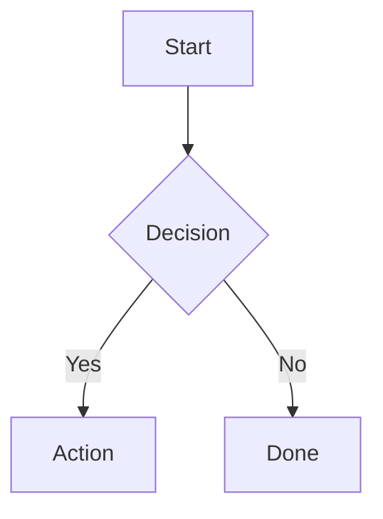
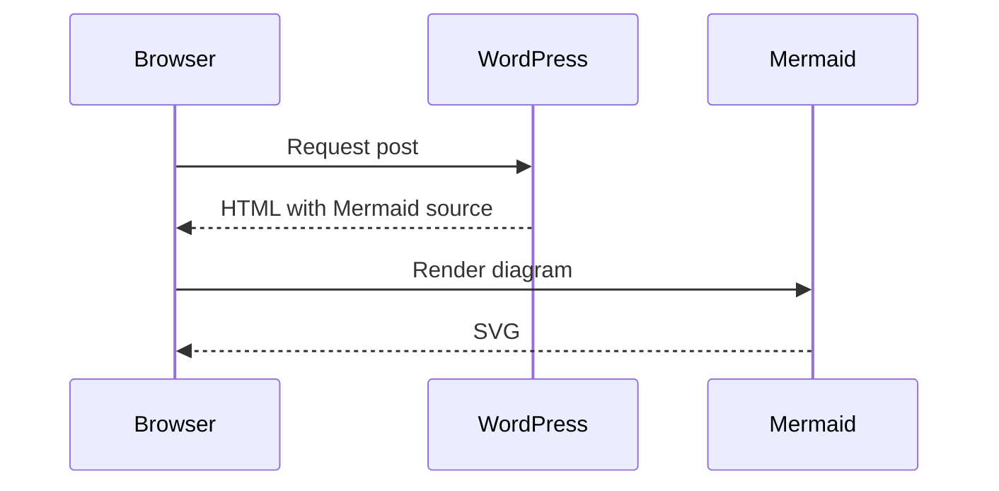
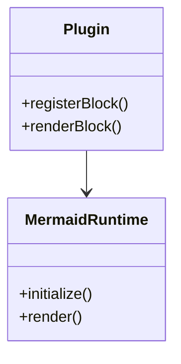

# Mermaid Content Blocks Examples

## Flowchart

```mermaid
flowchart TD
    A[Start] --> B{Decision}
    B -->|Yes| C[Action]
    B -->|No| D[Done]
```

## Sequence diagram

```mermaid
sequenceDiagram
    participant Browser
    participant WordPress
    participant Mermaid
    Browser->>WordPress: Request post
    WordPress-->>Browser: HTML with Mermaid source
    Browser->>Mermaid: Render diagram
    Mermaid-->>Browser: SVG
```

## Class diagram

```mermaid
classDiagram
    class Plugin {
        +registerBlock()
        +renderBlock()
    }
    class MermaidRuntime {
        +initialize()
        +render()
    }
    Plugin --> MermaidRuntime
```
