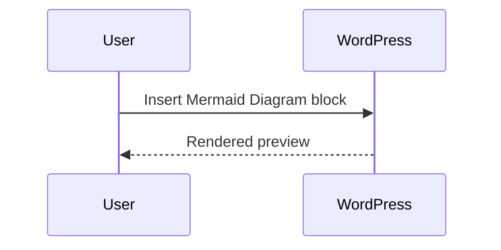

# Mermaid Content Blocks Manual Test Plan

## Environment

- WordPress 7.0 or later
- PHP 7.4 or later
- A user account with permission to edit posts

## Activation

1. Install `mermaid-content-blocks.zip` through Plugins > Add New > Upload Plugin.
2. Activate the plugin.
3. Confirm there are no PHP warnings in the admin UI or server logs.

## Editor block test

1. Create a new post.
2. Insert the `Mermaid Diagram` block.
3. Confirm the default flowchart appears in the editor preview.
4. Change the Mermaid source to:

5. Confirm the preview updates.
6. Set a caption.
7. Enable `Show source below rendered diagram`.
8. Publish or preview the post.

## Frontend rendering test

1. Open the published post in a logged-out/incognito browser window.
2. Confirm the diagram renders as SVG.
3. Confirm the caption is visible.
4. Confirm the source code is visible when `Show source below rendered diagram` is enabled.
5. Disable JavaScript and reload the page.
6. Confirm the Mermaid source remains visible as a graceful fallback.

## Error handling test

1. Edit the post and intentionally enter invalid Mermaid syntax.
2. Confirm the editor preview shows a render error.
3. Preview the frontend and confirm the source remains visible with a render error message.

## Security sanity check

1. Use a non-admin editor account if your site has multiple roles.
2. Confirm only trusted users have permission to edit/publish Mermaid block content.
3. Confirm browser console does not show CSP/script loading errors.
